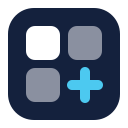
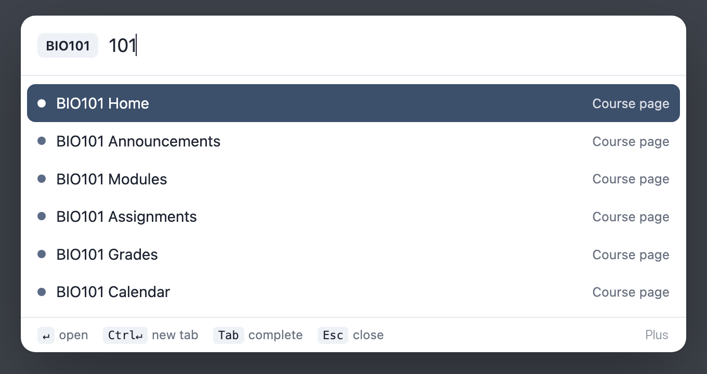
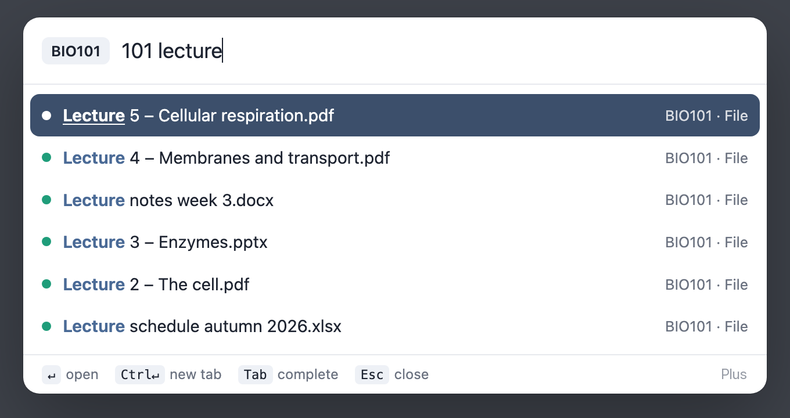

<p align="center"></p>

<h1 align="center">Plus for Canvas</h1>

<p align="center">Small upgrades for Canvas LMS: a command palette, a deadline overview and dark mode.<br>Press <kbd>⌘K</kbd>, type <code>101 mod</code>, land on the modules page.</p>

<p align="center"></p>

<p align="center"><br><sub>Files too: <code>101 lecture</code> finds every lecture file in BIO101 without opening the Files page.</sub></p>

## Features

* **Palette:** courses, course pages, modules, assignments, files, discussions, announcements and quizzes, one short query away. Courses answer to their code or number (`BIO101`, `101`), and you can add your own nicknames.
* **Deadlines** in Canvas' own menu, with a count and a countdown. `due` / `frist` in the palette shows the same list.
* **Home+**, an overview page inside Canvas: late work, the next two weeks, new grades and your courses.
* **Menu layout:** hide and reorder items in Canvas' menu.
* **Dark mode, colour themes** and a cleaner calendar month view.
* Works on `*.instructure.com` and `mitt.uib.no`, other Canvas domains can be added. English and Norwegian. Every feature can be turned off in the tray it adds to Canvas' menu, labelled **Plus**.

## Keys and queries

| Key | Action |
|---|---|
| <kbd>⌘K</kbd> / <kbd>Ctrl+K</kbd> | Open or close |
| <kbd>Enter</kbd> / <kbd>⌘Enter</kbd> | Open / open in new tab |
| <kbd>Tab</kbd> | Complete a course (`biology` → `101 `) |

| Query | Goes to |
|---|---|
| `101` | Course front page |
| `101 mod`, `210 ann`, `150 grades` | A course page |
| `101 hw2` | Search that course's content |
| `mod` | Modules in the course you are in |
| `dark`, `menu`, `refresh` | Toggle dark mode, Plus settings, reload data |

## Install

Download `plus-for-canvas-<version>.zip` from [Releases](https://github.com/andreas-vestbostad/plus-for-canvas/releases/latest) and unzip it, open `chrome://extensions`, turn on **Developer mode**, click **Load unpacked** and pick the unzipped folder. Works in Chrome, Edge, Brave, Arc and other Chromium browsers.

## Privacy

No server, no analytics. It only talks to the Canvas site you are on and caches in your browser. See [PRIVACY.md](PRIVACY.md).

## Development

No build step. Dark mode uses a bundled, unmodified copy of Dark Reader (MIT) in `src/vendor/darkreader/`. The settings gear is Lucide's icon (ISC, see `src/vendor/lucide/LICENSE`).

```sh
npm install       # ESLint, the only dev dependency
npm run lint      # catch mistakes
npm test          # unit tests (Node 18+)
npm run pack      # zip for a release
```

```
src/core/canvas.js     Canvas API client with caching
src/core/registry.js   module list, which scripts load where
src/content.js         loader: starts and stops enabled modules
src/lib/               matching, ranking, deadlines, themes
src/modules/           one folder per feature
options/               settings page
```

## Feedback

Bugs and ideas are welcome as [issues](https://github.com/andreas-vestbostad/plus-for-canvas/issues). Pull requests too: run `npm run lint` and `npm test` first.

## På norsk

Plus for Canvas gir Canvas (og Mitt UiB) hurtigsøk, fristoversikt, en egen oversiktsside og mørk modus. Trykk ⌘K og skriv `101 mod`.

## License

MIT. Canvas is a trademark of Instructure, Inc. This project is not affiliated with or endorsed by Instructure.
